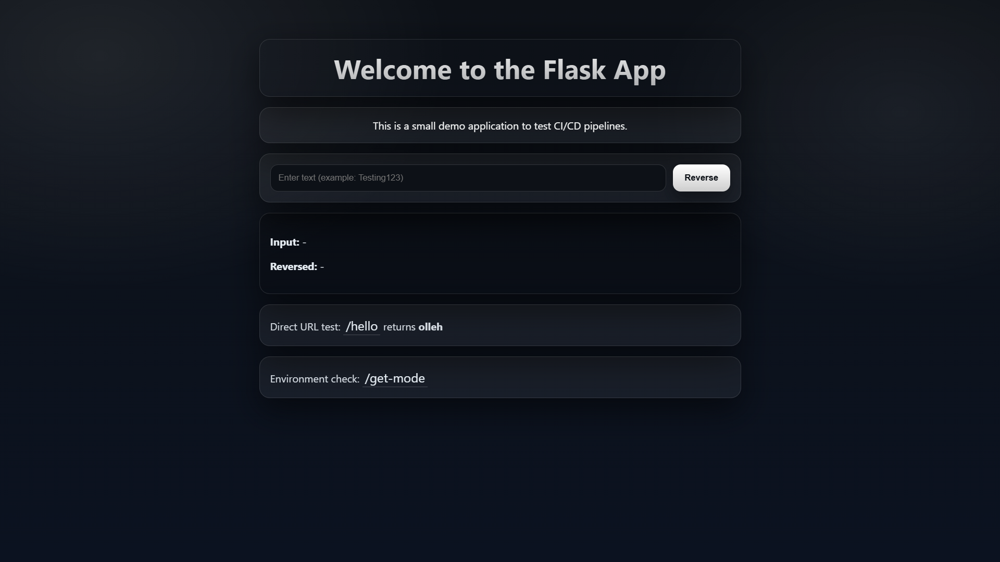
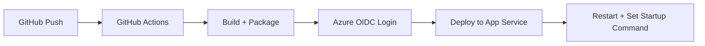

# CI-CD-Pipeline-Testing

Simple Flask project for practicing and validating CI/CD workflows.

## Table of Contents
- [General overview](#general-overview)
- [Local run](#local-run)
- [Azure setup](#azure-setup)
- [GitHub secrets (required)](#github-secrets-required)
- [Azure template deployment](#azure-template-deployment)
- [VS Code manual deploy](#vs-code-manual-deploy)
- [Deployment Flow](#deployment-flow)
- [Notes](#notes)
- [Troubleshooting](#troubleshooting)

## General overview
- Practice secure OIDC-based Azure deployments
- Avoid publishing long-lived credentials
- Validate ARM-based infrastructure automation
- Create a reusable CI/CD template for future projects



---

## Local run
- Create venv: `python -m venv .venv`
- Activate venv: `\.venv\Scripts\Activate.ps1`
- Install deps: `pip install -r requirements.txt`

## Azure setup
### Getting started
**Prerequisites:**	
- Install Azure CLI (`az`) locally.

Quick commands:
```bash
# Login
az login
# List subscriptions
az account list --output table
# Set the subscription you want to deploy to
az account set --subscription <your-subscription-id>
```
## GitHub secrets (required)
Create GitHub secrets:
- `AZURE_CLIENT_ID` 
- `AZURE_TENANT_ID`
- `AZURE_SUBSCRIPTION_ID`

**Important:**
- `AZURE_CLIENT_ID` should be the **client ID of the created user-assigned managed identity**.
- `AZURE_TENANT_ID` must match that **identity tenant**.
- `AZURE_SUBSCRIPTION_ID` must be the **target subscription**.

## Azure template deployment

### General info
- Scripts prompt for `WEBAPP_NAME`, `LOCATION`, `GITHUB_ORGANIZATION_NAME`, and `RESOURCE_GROUP`.
- Defaults come from `azuredeploy.parameters.json`.
- Customize values such as `webAppName`, `location`, `githubOrganizationName`, SKU settings, and `tags` in the parameters file.
- `WEBAPP_NAME` must be **globally unique** in Azure App Service.
- Not all Azure regions support all SKUs/resources - (**Canada Central** is recommended for testing).
- Federated credential creation can **fail** if the specified values do not match your GitHub Actions OIDC subject.
- Deployment provisions App Service and identity resources from `azuredeploy.json`.

### Setup steps for PowerShell and Bash
Follow these steps on your local machine:

```bash
# Login to Azure and set subscription if not done before
az login
az account set --subscription <your-subscription-id>
```
---

PowerShell (Windows):
```powershell

# Go to the azure directory to have access to the scripts
cd azure 

$env:WEBAPP_NAME="your-webapp-name"
$env:LOCATION="canadacentral"
$env:GITHUB_ORGANIZATION_NAME="your-github-user-or-org"
$env:RESOURCE_GROUP="your-rg-name"

# Run Script File
./deploy-webapp-powershell.ps1

#Force prompt without persisting new values: 
./deploy-webapp-powershell.ps1 -NoCache

# Clear cached prompt values:
./deploy-webapp-powershell.ps1 -ClearCache

```
---

Bash:
```bash

# Go to the azure directory to have access to the scripts
cd azure

export WEBAPP_NAME=your-webapp-name
export LOCATION=canadacentral
export GITHUB_ORGANIZATION_NAME=your-github-user-or-org
export RESOURCE_GROUP=your-rg-name

# Run Script File
bash ./deploy-webapp-bash.sh

# Force prompt and ignore shell-cached values: 
bash ./deploy-webapp-bash.sh --no-cache

# Clear cached prompt values:
bash ./deploy-webapp-bash.sh --clear-cache

```
---

```bash

# Optional: deploy directly with parameters file
az deployment group create \
	--resource-group <your-rg> \
  --template-file azuredeploy.json \
  --parameters @azuredeploy.parameters.json
```

### Resources created
- Linux App Service Plan (B1)
- Linux Python Web App (Python 3.12)
- System-assigned managed identity
- Startup command: Empty by default - (set later by deployment workflow or manual config)
- Tags including `repo=<repository-name>`

## VS Code manual deploy
- Install Azure App Service extension
- Sign in and select your Web App
- Right-click project folder -> **Deploy to Web App...**
- Deploy Managed identity from Azure portal
- Add Federated credential and permissions to the Managed Identity
- Startup command (if needed): `gunicorn --bind=0.0.0.0 --timeout 600 app.main:app`

---

## Deployment Flow
> Main workflow deploys to an existing Azure Web App. It does not create one.



### Workflow and inputs
- Main deploy workflow: `.github/workflows/build-flask-wapp.yml`
- Optional dispatch inputs: `webapp_name`, `resource_group`, `tag_key` (default `repo`), `tag_value`
- Resolution order:
  1. `webapp_name`
  2. repo variable `WEBAPP_NAME`
  3. tag lookup (`tag_key` + `tag_value` or repo-name default)

### Build and deploy behavior
1. Upload artifact with `app/` and `requirements.txt`
2. Download to `deploy_pkg`, validate required files
3. Zip as `deploy.zip`
4. Deploy attempt 1
5. On failure: restart app + wait 20s, then deploy attempt 2
6. On success: set startup command and restart app

- Startup command used:
`gunicorn --bind=0.0.0.0 --timeout 600 app.main:app`

## Notes
- Prefer manual `workflow_dispatch` when validating Azure changes.
- Set subscription once per shell and verify with `az account show`.
- App Service names are globally unique.
- **Security:** GitHub OIDC only (no long-lived Azure secrets), least-privilege RBAC, and isolated Web App identity.

## Troubleshooting
- **No web app resolved:** provide `WEBAPP_NAME` variable, `webapp_name` on workflow run, or matching tag on the web app.
- `AuthorizationFailed`: grant at least Reader on the target Web App/Resource Group.
- **OIDC mismatch:** ensure federated credential subject matches repo/branch/ref.
- **Wrong subscription:** run `az account show` and `az account set --subscription <id>`.