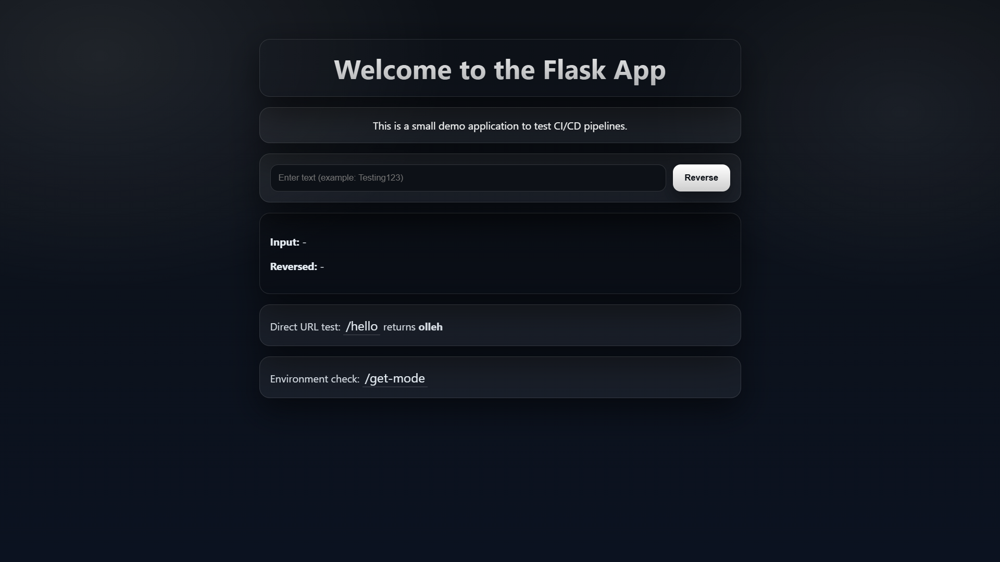
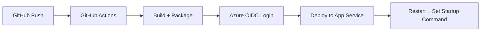

# CI-CD-Pipeline-Testing


Simple Flask project for practicing and validating CI/CD workflows.

## Table of Contents

- [General overview](#general-overview)
- [Local run](#local-run)
- [Azure setup](#azure-setup)
- [GitHub secrets (required)](#github-secrets-required)
- [Azure template deployment](#azure-template-deployment)
- [VS Code manual deploy](#vs-code-manual-deploy)
- [Deployment Flow](#deployment-flow)
- [Notes](#notes)
- [Troubleshooting](#troubleshooting)
- [Additional documentation](#additional-documentation)

## General overview

- Practice secure OIDC-based Azure deployments
- Avoid publishing long-lived credentials
- Validate ARM-based infrastructure automation
- Create a reusable CI/CD template for future projects
- Includes Docker checks in CI: Local image build test / DockerHub published-image test
- Centralizes reusable shell logic under `scripts/` for Docker and Azure operations
- Includes a Jenkins pipeline (`Jenkinsfile`) that replicates the DockerHub test flow as an alternative CI option



---

## Local run

- Create venv: `python -m venv .venv`
- Activate venv: `\.venv\Scripts\Activate.ps1`
- Install deps: `pip install -r requirements.txt`

## Azure setup

### Getting started

**Prerequisites:**

- Install Azure CLI (`az`) locally.

Quick commands:

```bash
# Login
az login
# List subscriptions
az account list --output table
# Set the subscription you want to deploy to
az account set --subscription <your-subscription-id>
```

## GitHub secrets (required)

Create GitHub secrets:

- `AZURE_CLIENT_ID`
- `AZURE_TENANT_ID`
- `AZURE_SUBSCRIPTION_ID`

For GitHub App authentication and Docker workflows, also set:

- `GH_APP_KEY`
- `DOCKERHUB_USERNAME`
- `DOCKERHUB_TOKEN`

**Important:**

- `AZURE_CLIENT_ID` should be the **client ID of the identity used for OIDC authentication** (managed identity or App Registration).
- `AZURE_TENANT_ID` must match that **identity tenant**.
- `AZURE_SUBSCRIPTION_ID` must be the **target subscription**.

**DockerHub secret notes:**

- `DOCKERHUB_USERNAME` must be only the Docker Hub account name (example: `brkndocker`).
- `DOCKERHUB_TOKEN` should be a Docker Hub access token with permission to push images.

**IMPORTANT**
The Docker test workflows (`.github/workflows/test-docker.yml` and `.github/workflows/test-dockerhub.yml`) require GitHub App authentication to be set up. Without `GH_APP_KEY` and `GH_APPLICATION_ID` configured, these workflows will fail.

Check out this documentation for a guide on Github App authentication and how to safely use GitHub secrets for both OIDC and App token scenarios:

[GitHub App Authentication Example](docs/github-app-example.md)

### Identity options for OIDC authentication

In this repository the ARM template provisions a **system-assigned managed identity** attached to the Web App.

Alternatively, an **Azure App Registration (Service Principal)** can be used for CI/CD authentication.

In general:

- **App Registration** is typically preferred for **CI/CD pipelines**, since it represents an external workload (e.g., GitHub Actions) authenticating to Azure using OIDC.
- **Managed Identity** is commonly used by **Azure resources themselves** (VMs, App Service, Functions) to securely access other Azure services such as Key Vault, Storage, or databases.

- **App Registration** with **Flexible Federated Credentials** also allows to
  run branch-specific workflows without long-lived secrets, by configuring the federated credential to only allow tokens from specific branches or workflows.

See the additional documentation for a step-by-step guide on configuring App Registration with OIDC:

[Flexible Federated Credential Setup](docs/flexible-federated-credential-setup.md)

## Azure template deployment

### General info

- Scripts prompt for `WEBAPP_NAME`, `LOCATION`, `GITHUB_ORGANIZATION_NAME`, and `RESOURCE_GROUP`.
- Defaults come from `azuredeploy.parameters.json`.
- Customize values such as `webAppName`, `location`, `githubOrganizationName`, SKU settings, and `tags` in the parameters file.
- `WEBAPP_NAME` must be **globally unique** in Azure App Service.
- Not all Azure regions support all SKUs/resources - (**Canada Central** is recommended for testing).
- Federated credential creation can **fail** if the specified values do not match your GitHub Actions OIDC subject.
- Deployment provisions App Service and identity resources from `azuredeploy.json`.

### Setup steps for PowerShell and Bash

Follow these steps on your local machine:

```bash
# Login to Azure and set subscription if not done before
az login
az account set --subscription <your-subscription-id>
```

---

PowerShell (Windows):

```powershell

# Go to the azure directory to have access to the scripts
cd azure

$env:WEBAPP_NAME="your-webapp-name"
$env:LOCATION="canadacentral"
$env:GITHUB_ORGANIZATION_NAME="your-github-user-or-org"
$env:RESOURCE_GROUP="your-rg-name"

# Run Script File
./deploy-webapp-powershell.ps1

#Force prompt without persisting new values:
./deploy-webapp-powershell.ps1 -NoCache

# Clear cached prompt values:
./deploy-webapp-powershell.ps1 -ClearCache

```

---

Bash:

```bash

# Go to the azure directory to have access to the scripts
cd azure

export WEBAPP_NAME=your-webapp-name
export LOCATION=canadacentral
export GITHUB_ORGANIZATION_NAME=your-github-user-or-org
export RESOURCE_GROUP=your-rg-name

# Run Script File
bash ./deploy-webapp-bash.sh

# Force prompt and ignore shell-cached values:
bash ./deploy-webapp-bash.sh --no-cache

# Clear cached prompt values:
bash ./deploy-webapp-bash.sh --clear-cache

```

---

```bash

# Optional: deploy directly with parameters file
az deployment group create \
	--resource-group <your-rg> \
  --template-file azuredeploy.json \
  --parameters @azuredeploy.parameters.json
```

### Resources created

- Linux App Service Plan (B1)
- Linux Python Web App (Python 3.12)
- System-assigned managed identity
- Startup command: Empty by default - (set later by deployment workflow or manual config)
- Tags including `repo=<repository-name>`

## VS Code manual deploy

- Install Azure App Service extension
- Sign in and select your Web App
- Right-click project folder -> **Deploy to Web App...**
- Configure the Managed Identity or App Registration in the Azure portal
- Add Federated credential and permissions to the Managed Identity / App Registration
- Startup command (if needed): `gunicorn --bind=0.0.0.0 --timeout 600 app.main:app`

---

## Deployment Flow

> Main workflow deploys to an existing Azure Web App. It does not create one.


```mermaid
flowchart LR
  A[GitHub Push] --> B[GitHub Actions]
  B --> C[Build + Package]
  C --> D[Azure OIDC Login]
  D --> E[Deploy to App Service]
  E --> F[Restart + Set Startup Command]
```

### Workflow and inputs

- Main deploy workflow: `.github/workflows/build-flask-wapp.yml`
- Optional dispatch inputs: `webapp_name`, `resource_group`, `tag_key` (default `repo`), `tag_value`
- Resolution order:
  1. `webapp_name`
  2. repo variable `WEBAPP_NAME`
  3. tag lookup (`tag_key` + `tag_value` or repo-name default)

### Test workflows

- `.github/workflows/publish-docker-image.yml`
  - Builds and pushes the Jenkins Agent image (`brkndocker/jenkins-agent`) to Docker Hub.

- `.github/workflows/test-docker.yml`
  - Builds a local Docker image and runs the full local flow via `app/tests/docker_local_test.py`.
  - Validates GitHub App token authentication (requires `GH_TOKEN` and `TARGET_REPO` env vars).
  - Pushes test result markdown to the target repository directly from within the test (skipped on pull request events).

- `.github/workflows/test-dockerhub.yml`
  - Builds `brkndocker/ghapp-test` from `docker/dockerhub-image/Dockerfile` and runs in-container tests via `app/tests/dockerhub_test.py`.
  - Builds, tests, and pushes the image (including a SHA-tagged version) on each successful run.

- Alternative CI pipeline: `Jenkinsfile` — replicates the DockerHub test flow outside of GitHub Actions using a Docker agent. See [Jenkins Configuration](docs/jenkins-configuration.md) for setup instructions.

### Shared scripts

- `scripts/azure-webapp-workflow.sh`
  - Shared Azure helper for app resolution, preflight validation, packaging, deployment with retry, and startup configuration.

- `scripts/entrypoint.sh`
  - Container entrypoint used inside the DockerHub image (`brkndocker/ghapp-test`) for authenticated git clone with retry logic.

### GitHub App Token Testing Strategy

The two test workflows validate GitHub App token authentication from **different execution contexts**:

| Workflow               | Test File              | Execution Context       | Git Clone Location               |
| ---------------------- | ---------------------- | ----------------------- | -------------------------------- |
| **test-docker.yml**    | `docker_local_test.py` | GitHub Actions runner   | Inside container (from host)     |
| **test-dockerhub.yml** | `dockerhub_test.py`    | Freshly built container | Inside container (entrypoint.sh) |

This dual-context approach ensures:

- GH_TOKEN works when used directly from GitHub Actions
- GH_TOKEN works when passed into a pre-built Docker container
- Git clone with retry logic works inside the container environment
- Flask app integration tests pass in both local and pre-built images

### Build and deploy behavior

1. Upload artifact with `app/` and `requirements.txt`
2. Download to `deploy_pkg`, validate required files
3. Zip as `deploy.zip`
4. Deploy with retry using shared script mode (`deploy_with_retry`)
5. On success: set startup command and restart app using shared script mode (`configure_startup`)

- Startup command used:
  `gunicorn --bind=0.0.0.0 --timeout 600 app.main:app`

## Notes

- Set subscription once per shell and verify with `az account show`.
- App Service names are globally unique.
- **Security:** GitHub OIDC only (no long-lived Azure secrets), least-privilege RBAC, and isolated Web App identity.
- The `.github/workflows/pgbench-test.yml` workflow triggers automatically on push and pull requests to `pgbench/*` branches, and also supports manual `workflow_dispatch` (with optional `webapp_name` and `resource_group` inputs).
- For `pgbench/*` branch-based deployments to work with OIDC, configure an App Registration with Flexible Federated Credentials (see [Flexible Federated Credential Setup](docs/flexible-federated-credential-setup.md)).

## Troubleshooting

- **No web app resolved:** provide `WEBAPP_NAME` variable, `webapp_name` on workflow run, or matching tag on the web app.
- `AuthorizationFailed`: grant at least Reader on the target Web App/Resource Group.
- **OIDC mismatch:** ensure federated credential subject matches repo/branch/ref.
- **Wrong subscription:** run `az account show` and `az account set --subscription <id>`.

---

## Additional documentation

Detailed guides related to this CI/CD setup:

- [Flexible Federated Credential Setup](docs/flexible-federated-credential-setup.md)  
  Step-by-step configuration for Azure OIDC authentication using flexible federated credentials.

- [GitHub App Authentication Example](docs/github-app-example.md)  
  Overview of GitHub App authentication in GitHub Actions, explaining how it differs from PATs, how App tokens differ from the auto-generated `GITHUB_TOKEN`, and how to safely use both for secure cross-repository automation.

- [Jenkins Configuration](docs/jenkins-configuration.md)  
  Step-by-step guide for setting up a local Jenkins instance with Docker-in-Docker, configuring the Docker Cloud agent, creating the required credentials, and running the `Jenkinsfile` pipeline.

### References

- Azure OIDC authentication with GitHub Actions  
  https://learn.microsoft.com/en-us/azure/developer/github/connect-from-azure-openid-connect

- Flexible Federated Identity Credentials (Microsoft Entra)  
  https://learn.microsoft.com/en-us/entra/workload-id/workload-identities-flexible-federated-identity-credentials

- Azure App Service deployment with GitHub Actions  
  https://learn.microsoft.com/en-us/azure/app-service/deploy-github-actions
