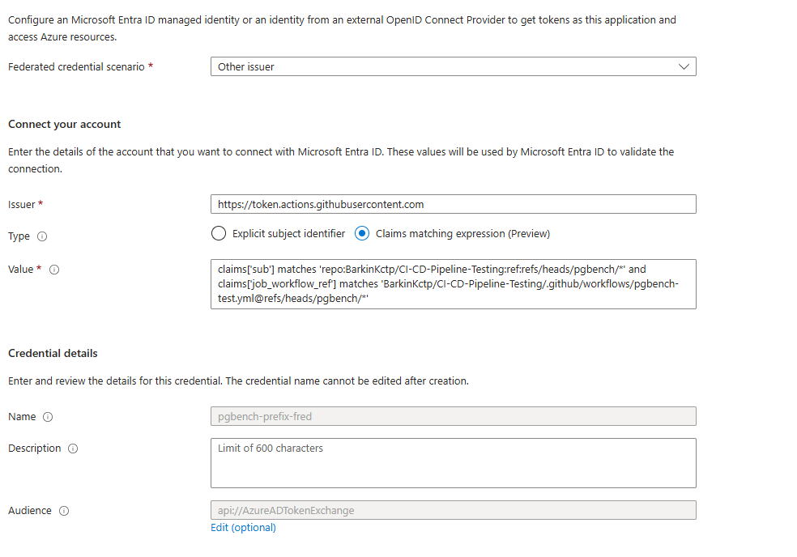

# Azure Flexible Federated Credential for GitHub Actions (OIDC Login)

This guide shows how to authenticate GitHub Actions to Azure **without secrets** using **OIDC** and an **Azure App Registration** with a **Flexible Federated Identity Credential (FIC)**.

> Result: GitHub Actions can run `azure/login@v2` using OIDC and then deploy / run Azure CLI commands securely.
> Example: `pgbench/*` branch prefix

---

## Why Flexible Federated Credentials?

Standard Azure Federated Identity Credentials require **exact claim matching**, meaning each branch, tag, or workflow often needs its own credential.

Flexible Federated Credentials allow **pattern-based claim matching** using expressions such as `matches`, which enables:

- **Wildcard branch support** (e.g. `pgbench/*`)
- **Reusable credentials across multiple workflows**
- **Reduced credential management overhead**
- **Avoiding Azure's federated credential limits**

Flexible Federated Credentials are especially useful in CI/CD environments where pipelines run on **multiple feature branches or dynamically created branches**.

---

## Prerequisites

- You have an Azure Subscription where you can:
  - Create an App Registration
  - Assign roles (RBAC) at subscription or resource-group scope
    
- Your workflow will request OIDC tokens:
  - `permissions: id-token: write`

---

## 1. Create an App Registration

Azure Portal:
1. **Microsoft Entra ID** → **App registrations** → **New registration**
2. Name it something like: `gh-oidc-ci-cd`
3. Create it

After creation, note:
- **Application (client) ID**
- **Directory (tenant) ID**
- **Subscription ID**

---

## 2. Add Required GitHub Secrets

Navigate to:
Repository → Settings → Secrets and variables → Actions

Create the following **repository secrets**:

| Secret Name | Value |
|-------------|------|
| AZURE_CLIENT_ID | Application (client) ID |
| AZURE_TENANT_ID | Directory (tenant) ID |
| AZURE_SUBSCRIPTION_ID | Azure Subscription ID |

---

## 3. Create a Flexible Federated Credential (Other Issuer)

Azure Portal:
1. Go to your App Registration
2. **Certificates & secrets** → **Federated credentials** → **Add credential**
3. Choose **Other issuer** (for flexible claim matching)

Use:

- **Issuer**:  
  `https://token.actions.githubusercontent.com`

- **Name**:  
  `pgbench-tests-FIC`

- **Subject** (flexible claim matching expression example):
`claims['sub'] matches 'repo:<repo>:ref:refs/heads/pgbench/*' and claims['job_workflow_ref'] matches '<repo>/.github/workflows/<workflow>@refs/heads/pgbench/*'`

- **Audience** (recommended for Azure OIDC):
`api://AzureADTokenExchange`

This targets **only** pushes/PRs on branches like `pgbench/*` and only when the workflow file path matches.
If your repo/workflow path differs, update both parts.

---

### Example Azure Portal Configuration



Example configuration of a Flexible Federated Credential using GitHub Actions OIDC with branch prefix matching (`pgbench/*`).

---

## 4. Assign Azure RBAC Roles to the App Registration

The App Registration must have permissions in your Azure subscription or resource group.

1. Go to **Azure Portal**
2. Navigate to **Subscriptions**
3. Select your target subscription
4. Open **Access control (IAM)**
5. Click **Add → Add role assignment**

Recommended roles:

| Role | When to use |
|-----|-----|
| Reader | Minimum required if pipeline only reads resources |
| Contributor | Required if pipeline deploys resources |
| Website Contributor | Deploying to Azure App Service |
| Web Plan Contributor | Managing App Service Plans |

Steps:

1. Select the role
2. Click **Next**
3. Choose **User, group, or service principal**
4. Search for your **App Registration name**
5. Select it and click **Review + Assign**

> Example:  
> `gh-oidc-ci-cd` (App Registration used for CI/CD)

---

## 5. Configure Workflow Triggers and OIDC Authentication

Configure your GitHub Actions workflow to run on the desired branch prefix and authenticate to Azure using OIDC.

Example workflow trigger for `pgbench/*` branches:

```yaml
on:
  push:
    branches:
      - pgbench/*
  pull_request:
    branches:
      - pgbench/*
  workflow_dispatch:

permissions:
  contents: read
  id-token: write

- name: Azure Login (OIDC)
  uses: azure/login@v2
  with:
    client-id: ${{ secrets.AZURE_CLIENT_ID }}
    tenant-id: ${{ secrets.AZURE_TENANT_ID }}
    subscription-id: ${{ secrets.AZURE_SUBSCRIPTION_ID }}


```  
---

## Troubleshooting

### AADSTS700213 – No matching federated identity record found

>This error occurs when the claims in the GitHub OIDC token do not match the conditions defined in the Federated Credential.

Common causes:

- Branch name does not match the configured prefix
- Workflow file path does not match `job_workflow_ref`
- Repository owner or repository name mismatch
- Incorrect issuer URL
- Azure RBAC not configured properly:

Check the GitHub Actions logs from the `azure/login` step. The logs usually show the claims used in the authentication request.
If `azure/login` works but deployment commands fail, the App Registration likely lacks the required RBAC role.

Verify that the correct role has been assigned under:

Subscription → Access Control (IAM)

---

## Best Practices / Notes

### Restrict Federated Credentials

Avoid allowing all branches or workflows. Restrict authentication as much as possible.

Instead of granting permissions at the subscription level, assign RBAC roles at the **resource group level** whenever possible.

This reduces blast radius if the workflow is compromised.

---

### Avoid Secrets for Azure Authentication

OIDC authentication removes the need for:

- Azure Service Principal secrets
- Long-lived credentials
- Rotating tokens

GitHub issues a **short-lived** token for each workflow run, which Azure validates through the federated credential.

## References

Official Microsoft documentation on Flexible Federated Identity Credentials:

- Microsoft Learn – Flexible Federated Identity Credentials  
  https://learn.microsoft.com/en-us/entra/workload-id/workload-identities-flexible-federated-identity-credentials

These credentials allow pattern-based claim matching (such as branch prefixes or workflow filters) so that a single credential can authorize multiple CI/CD workflows instead of creating separate credentials for each branch or workflow. :contentReference[oaicite:0]{index=0}


