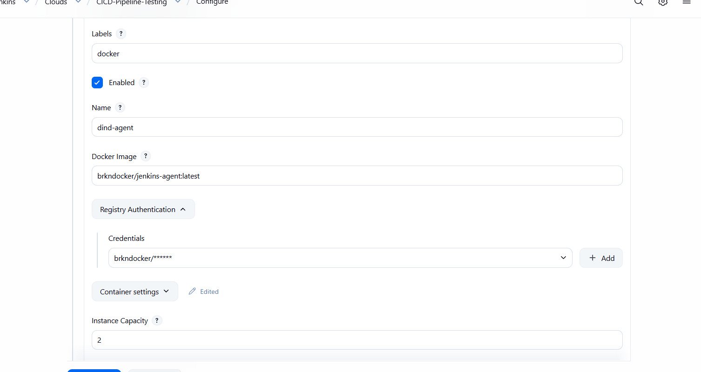
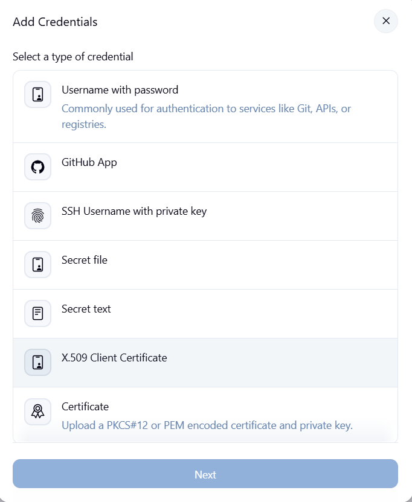
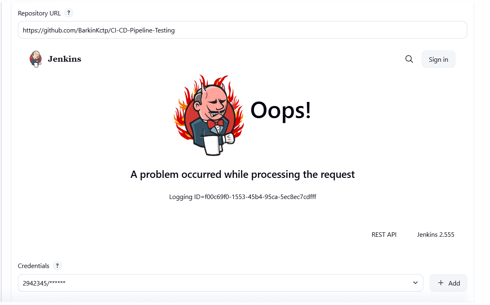

# Jenkins Configuration Guide

> **Note:** This guide assumes you have a GitHub App set up. If you haven't created one yet, see [github-app-example.md](github-app-example.md) first.

---

## 1. Prerequisites

- Docker Desktop installed and running on your machine
- A Docker Hub account (if pushing/pulling private images)
- A GitHub App configured with appropriate permissions for your repositories

---

## 2. Build the Custom Jenkins Image

Build the Jenkins image from the provided Dockerfile:

```powershell

cd docker/jenkins-image

docker build -t myjenkins:latest .
```

This image includes:

- Jenkins LTS with JDK 21
- Python 3 (via `python3-pip`)
- Docker CLI (to run Docker commands inside Jenkins)
- Essential pipeline and Docker plugins

---

## 3. Create the Docker Network

```powershell
docker network create jenkins
```

---

## 4. Run the Docker-in-Docker (DinD) Container

This container allows Jenkins to build and run Docker images:

```powershell
docker run --name docker --privileged --network jenkins `
  --env DOCKER_TLS_CERTDIR=/certs `
  --volume jenkins-docker-certs:/certs/client `
  --volume jenkins-data:/var/jenkins_home `
  -d docker:dind
```

---

## 5. Run the Jenkins Container

```powershell
docker run --name jenkins --restart=on-failure --detach `
  --network jenkins `
  --env DOCKER_HOST=tcp://docker:2376 `
  --volume jenkins-data:/var/jenkins_home `
  --publish 8080:8080 `
  --publish 50000:50000 `
  myjenkins:latest
```

Access Jenkins at: **http://localhost:8080**

---

## 6. Verify Docker Connectivity from Jenkins

Run this to confirm Jenkins can talk to the DinD container over TLS:

```powershell
docker exec jenkins sh -c "curl -s --cacert /certs/ca.pem --cert /certs/cert.pem --key /certs/key.pem https://docker:2376/version"
```

---

## 7. Configure Docker Cloud in Jenkins

1. Go to **Manage Jenkins → Clouds → New Cloud → Docker**
2. Set **Docker Host URI**: `tcp://docker:2376`
3. Set **Server credentials**: Select the `docker-tls-certs` credential created in [Step 8](#8-configure-credentials-in-jenkins)
4. Click **Test Connection** to verify it works
5. Click **Save**

### Configure a Docker Cloud Agent Template

After setting up the Docker Cloud connection, you need an **agent template** so Jenkins can spin up containers to run builds.



> This project uses a custom agent image with Python tooling for running `pytest`. It is **public on Docker Hub** (`brkndocker/jenkins-agent:latest`). You can also build and push your own copy.

1. Inside the Docker Cloud config, click **Docker Agent templates → Add Docker Template**
2. Configure the following:
   - **Labels**: `docker`
   - **Enabled**: Checked
   - **Name**: `dind-agent` (example)
   - **Docker Image**: `brkndocker/jenkins-agent:latest`
   - **Registry Authentication → Credentials**: Select your Docker Hub credential (`jenkins-docker-login`) so the agent can pull from Docker Hub
   - **Remote File System Root**: `/home/jenkins/agent`
   - **Connect method**: **Attach Docker container**
   - **Pull strategy**: **Pull once and update latest**
   - **Volumes**: `/var/run/docker.sock:/var/run/docker.sock`
   - **Instance Capacity**: `2` (recommended in this example to reduce overload risk)

3. Click **Save**

> **Important:** The Jenkinsfile uses label `docker`, so the template label must match.

### Use Custom Agent Image (Optional)

If you prefer to build and push your own copy of the agent image, run:

```powershell
# Login to Docker Hub first
docker login

cd docker/jenkins-agent-image

docker build -t <yourdockerhubname>/jenkins-agent:latest .
docker push <yourdockerhubname>/jenkins-agent:latest
```

Then update the agent template **Docker Image** to: `<yourdockerhubname>/jenkins-agent:latest`

---

## 8. Configure Credentials in Jenkins

Create all Jenkins credentials in this section before running pipeline jobs.

### Docker TLS Credentials (required for Docker Cloud)

Export the TLS certificate files from the DinD volume:

```powershell
docker run --rm `
  -v jenkins-docker-certs:/certs `
  -v "C:\Users\barki\Desktop:/output" `
  alpine sh -c "cp /certs/cert.pem /output/ && cp /certs/key.pem /output/ && cp /certs/ca.pem /output/"
```

Verify the files exist before continuing:

```powershell
ls C:\Users\barki\Desktop\*.pem
```

If no files appear, change the `-v` output path in the export command (e.g. `C:\Users\barki\Downloads`) and rerun it.

Then create an **X.509 Client Certificate** credential in Jenkins:



1. Go to **Manage Jenkins → Credentials → Add Credentials**
2. Kind: **X.509 Client Certificate**
3. ID: `docker-tls-certs`
4. Upload:
   - **Client Key File**: `key.pem`
   - **Client Certificate File**: `cert.pem`
   - **CA Certificate File**: `ca.pem`
5. Click **Create**

> **Important:** Jenkins requires all three files (`key.pem`, `cert.pem`, and `ca.pem`) for secure TLS communication with the DinD container.

### Docker Hub Credentials (for private registries)

1. Go to **Manage Jenkins → Credentials → Add Credentials**
2. Kind: **Username with password**
3. ID: `jenkins-docker-login`
4. Username: Docker Hub username
5. Password: Docker Hub access token

> **Note:** The credential ID must be exactly `jenkins-docker-login` — the Jenkinsfile is hardcoded to use this ID.

### GitHub App Credentials (required for this workflow)

1. Go to **Manage Jenkins → Credentials → Add Credentials**
2. Kind: **GitHub App**
3. ID: `ghapp-creds`
4. Fill in: **App ID**, **Private Key**, and **Installation ID**
5. In the GitHub App installation settings, set **Repository access** to include:
   - This pipeline repository (contains `Jenkinsfile`)
   - The repository used by `TARGET_REPO`
6. If using **Only select repositories**, add them explicitly before running the pipeline.

> **Important:** The private key must be in **PKCS#8 format**. Convert if needed:
>
> ```powershell
> openssl pkcs8 -topk8 -inform PEM -outform PEM -nocrypt -in <your-key>.pem -out new.pem
> ```

> **Important:** If required repositories are not included in the GitHub App installation access list, pipeline checkout/test stages can fail with credential/token errors, including `f args` or `not found` errors.

### Using GitHub App Credentials in a Jenkinsfile

```groovy
withCredentials([
    usernamePassword(
        credentialsId: params.GH_CREDENTIALS_ID,
        usernameVariable: 'GITHUB_APP',
        passwordVariable: 'GH_TOKEN'
    )
]) {
    // Your steps that require GitHub App authentication
}
```

---

## 9. Create the Jenkins Pipeline Job (with Parameters)

This repository's Jenkins pipeline is defined in `Jenkinsfile` and includes runtime parameters.

1. Go to **Dashboard → New Item**
2. Enter a job name (example: `ghapp-dockerhub-pipeline`)
3. Select **Pipeline**
4. Click **OK**
5. In **General**, optionally enable **GitHub project** and add your repo URL
6. In **Build Triggers**, choose one of the following:
   - **GitHub hook trigger for GITScm polling** (for webhook-driven builds)
   - **Poll SCM** (if you prefer periodic polling)
7. In **Pipeline**, set:
   - **Definition**: **Pipeline script from SCM**
   - **SCM**: **Git**
   - **Repository URL**: Your repository URL (HTTPS)
   - **Credentials**: Select your GitHub App credential (`ghapp-creds`) if required for private access
   - **Branch Specifier**: `*/main` (or your branch)
   - **Script Path**: `Jenkinsfile`
8. Click **Save**

> **Note:** If Jenkins shows an "Oops!" error or the credential dropdown does not list `ghapp-creds`, restart Jenkins (`docker restart jenkins`) and try again — newly added credentials sometimes require a restart to load.



### Pipeline Parameters Used by this Jenkinsfile

The following parameters are defined in `Jenkinsfile` and appear in **Build with Parameters**:

1. `TARGET_REPO`
   - Default: `BarkinKctp/ghapp-oidc-deploy-test`
   - Purpose: Repository used by test flow inside the container
2. `DOCKER_TEST_IMAGE`
   - Default: `brkndocker/ghapp-test:latest`
   - Purpose: Docker image consumed by `app/tests/dockerhub_test.py`
3. `GH_CREDENTIALS_ID`
   - Default: `ghapp-creds`
   - Purpose: Jenkins credential ID used for GitHub App auth in pipeline stages

> **Important:** On first run, Jenkins may not show parameters until it reads the Jenkinsfile from SCM. If **Build with Parameters** is missing, run the job once, then reopen the job page.

### Run Checklist

Before running **Build with Parameters**, verify:

1. Docker Cloud connection is green (Step 7)
2. Docker template label is `docker`
3. Credentials exist: `docker-tls-certs`, `jenkins-docker-login`, and `ghapp-creds`
4. Pipeline SCM points to this repo and `Jenkinsfile`

---

## Quick Start Commands

```powershell
# 1. Build the Jenkins controller image
cd docker/jenkins-image
docker build -t myjenkins:latest .

# 2. Create the Docker network
docker network create jenkins

# 3. Start DinD
docker run --name docker --privileged --network jenkins `
  --env DOCKER_TLS_CERTDIR=/certs `
  --volume jenkins-docker-certs:/certs/client `
  --volume jenkins-data:/var/jenkins_home `
  -d docker:dind

# 4. Start Jenkins
docker run --name jenkins --restart=on-failure --detach `
  --network jenkins `
  --env DOCKER_HOST=tcp://docker:2376 `
  --volume jenkins-data:/var/jenkins_home `
  --publish 8080:8080 `
  --publish 50000:50000 `
  myjenkins:latest

# 5. Optional: pull the published agent image
docker pull brkndocker/jenkins-agent:latest

# 6. Get initial admin password
docker exec jenkins cat /var/jenkins_home/secrets/initialAdminPassword
```

---

## Troubleshooting

### Docker Cloud connection failed

- Verify DinD container is running:
  ```powershell
  docker ps --filter name=docker
  ```
- Check both containers are on the same network:

  ```powershell
  docker network inspect jenkins
  ```

- Ensure **X.509 Client Certificate** credential has all three files.
- Re-run the connectivity check from [Step 6](#6-verify-docker-connectivity-from-jenkins).

### "Permission denied" when running Docker commands inside Jenkins

- Ensure Jenkins is connecting to DinD with the correct TLS credentials.
- Confirm the `DOCKER_HOST` environment variable is set:

  ```powershell
  docker exec jenkins env | findstr DOCKER_HOST
  ```

- Should return: `DOCKER_HOST=tcp://docker:2376`

### Agent containers fail to start

- Verify agent image is accessible:
  ```powershell
  docker exec docker docker pull brkndocker/jenkins-agent:latest
  ```
- Check Jenkins logs:
  ```powershell
  docker logs jenkins --tail 50
  ```

### Cannot pull agent image from Docker Hub

- If using custom image, log in and push first:
  ```powershell
  docker login
  cd docker/jenkins-agent-image
  docker build -t <yourdockerhubname>/jenkins-agent:latest .
  docker push <yourdockerhubname>/jenkins-agent:latest
  ```

### Jenkins shows "Oops!" error during pipeline setup

**Symptom:** "Oops! A problem occurred while processing the request" when saving pipeline or selecting credentials.

- A newly created credential has not been fully loaded yet.
- **Fix:** `docker restart jenkins`, then reopen the job and complete the SCM setup.

### GitHub App auth fails with `access` error

- Confirm the Jenkins GitHub App credential (`ghapp-creds`) uses the correct **App ID**, **Installation ID**, and **private key**.
- In GitHub, open the app installation and verify **Repository access** includes:
  - This pipeline repo
  - The repository in `TARGET_REPO`
- If the Jenkins pipeline error says it cannot access the target repo, check the GitHub App used by Jenkins credential `ghapp-creds` and ensure the app installation includes the `TARGET_REPO` repository.
- If you changed app access, reinstall/update the app installation and rerun the pipeline.
- Ensure the pipeline parameter `GH_CREDENTIALS_ID` still points to `ghapp-creds` (or your actual credential ID).

### Port 8080 already in use

**Symptom:** `Bind for 0.0.0.0:8080 failed: port is already allocated`

- Stop whatever is using port 8080, or map Jenkins to a different port:

  ```powershell
  docker run --name jenkins --restart=on-failure --detach `
    --network jenkins `
    --env DOCKER_HOST=tcp://docker:2376 `
    --volume jenkins-data:/var/jenkins_home `
    --publish 9090:8080 `
    --publish 50000:50000 `
    myjenkins:latest
  ```

- Then access Jenkins at **http://localhost:9090**.

### Forgot the initial admin password

```powershell
docker exec jenkins cat /var/jenkins_home/secrets/initialAdminPassword
```

### Need to start fresh

Remove all containers and volumes to reset everything:

```powershell
docker stop jenkins docker
docker rm jenkins docker
docker volume rm jenkins-data jenkins-docker-certs
docker network rm jenkins
```

Then re-run from [Step 2](#2-build-the-custom-jenkins-image).

---

## References

- [Jenkins Credentials documentation](https://www.jenkins.io/doc/book/using/using-credentials/)
- [GitHub App authentication for Jenkins](https://www.jenkins.io/blog/2020/04/16/github-app-authentication/)
- [GitHub App installation permissions](https://docs.github.com/en/apps/using-github-apps/installing-your-own-github-app)
